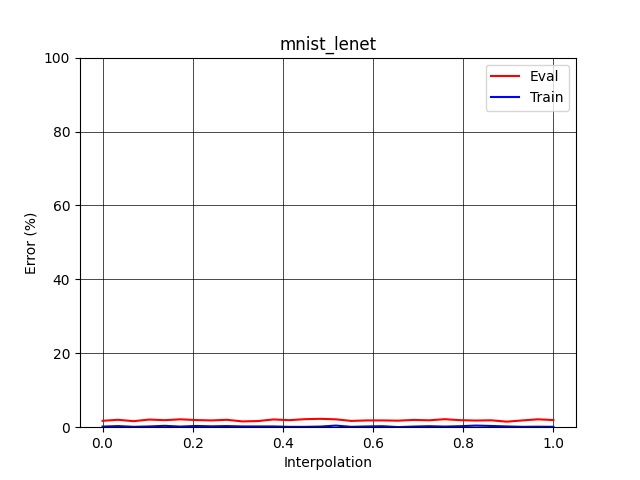
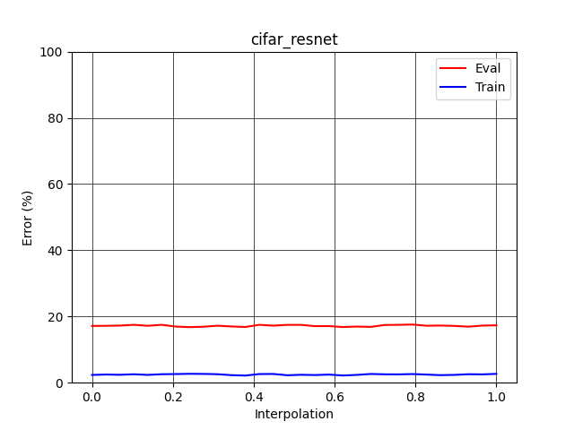
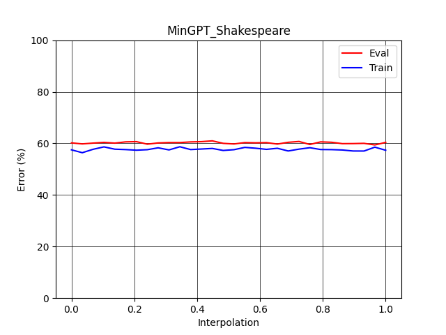

# Linear Mode Connectivity and the Lottery Ticket Hypothesis

- [Introduction](#introduction)
- [Results](#results)

## Introduction
This project reimplements some of the methods of the paper ["Linear Mode Connectivity and the Lottery Ticket Hypothesis"](https://arxiv.org/pdf/1912.05671) by Frankle et al (2020). Frankle et al. studies whether networks converge to the same, linearly connected minimum under different batch samples of SGD noise via instability analysis. I would like to investigate whether linear mode connectivity exist in architectures such as LeNet and ResNet on datasets such as MNIST and CIFAR and replicate the results from the paper. Additionally, I aim to extend the research by investigating whether linear mode connectivity exists in transformers, specifically decoder-only transformers.

The baseline transformer model is inspired by Karpathy's minGPT implementation.

## Experiments
Unlike the authors who have trained each network 3 times from random initialization, I only trained my networks once. The authors did not fully specify what initializations they used for their network, but only that the two copies of the network must be initialized the same. Nevertheless, I used Kaming Init for the weights in Lenet and the pytorch default initialization on Resnet20. 

## Results

Lenet result is consistent with the authors' results: the network is stable at initialization.

Resnet result, for some reason, is not quite consistent; my network is stable at initialization, but the authors suggest otherwise.
The number of parameters in the Resnet20 I trained is 272K params, which is different from the 274K params specified in the paper.
<!--  -->
